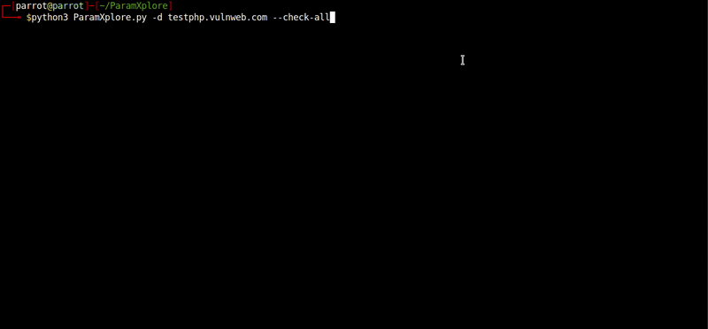

# ParamXplore
### Automated Parameter Finder & Injector ###

---

**ParamXplore** is an advanced parameter discovery and vulnerability testing tool inspired by **ParamSpider**. It mines URLs from archived web data, identifies query parameters, and tests for various vulnerabilities, including SSRF, SQL Injection, LFI, SSTI, XSS, and more.


---

## 🔍 **Features**

- **Comprehensive Parameter Discovery**: Extract URLs with parameters from web archives for your target domain.
- **Vulnerability Testing**: Automates testing for the following vulnerabilities:
  - SQL Injection
  - Server-Side Request Forgery (SSRF)
  - Local File Inclusion (LFI)
  - Server-Side Template Injection (SSTI)
  - Cross-Site Scripting (XSS)
  - Command Injection
- **Custom Payloads**: Define your payloads for specific vulnerabilities.
- **Filtered Results**: Skips URLs without parameters to save time.
- **SSRF Validation**: Requires a valid server URL for accurate SSRF testing.
- **Streamlined Output**: Summarizes detected vulnerabilities with parameter names, payloads, and response snippets.

---

## 🚀 **Installation**

### 1. Clone the Repository
```bash
git clone https://github.com/yourusername/ParamXplore.git
cd ParamXplore
```

### 2. Install Dependencies
Ensure Python 3.8+ is installed. Use the included `install.sh` for dependency installation:

```bash
chmod +x install.sh
./install.sh
```

Or manually install dependencies:

```bash
pip install -r requirements.txt
```

### 3. Verify Installation
Run the tool to verify successful setup:

```bash
python ParamXplore.py --help
```

---

## 📷 **Screenshot**



---

## 🛠️ **Usage**

### Basic Usage
```bash
python ParamXplore.py -d example.com
```

### Advanced Options
#### 1. Test for Specific Vulnerabilities
- **SQL Injection**:
  ```bash
  python ParamXplore.py -d example.com --check-sql
  ```
- **SSRF (Requires server. I suggest incorporating the BurpSuite Collaborator client at this point, enabling you to monitor and capture any hits directly within the Collaborator interface)**:
  ```bash
  python ParamXplore.py -d example.com --check-ssrf --ssrf-server http://your-ssrf-server.com
  ```
- **Check All Vulnerabilities**:
  ```bash
  python ParamXplore.py -d example.com --check-all
  ```

#### 2. Use a File with Domains
```bash
python ParamXplore.py -l domains.txt
```

#### 3. Stream Results to Terminal
```bash
python ParamXplore.py -d example.com --stream
```

---

## ⚙️ **Command-Line Options**

| Option                | Description                                                                 |
|-----------------------|-----------------------------------------------------------------------------|
| `-d, --domain`         | Specify a single domain for analysis.                                      |
| `-l, --list`           | Provide a file containing multiple domains.                                |
| `--check-sql`          | Test for SQL Injection vulnerabilities.                                   |
| `--check-ssrf`         | Test for SSRF vulnerabilities (requires `--ssrf-server`).                 |
| `--ssrf-server`        | Provide a server for SSRF validation.                                      |
| `--check-lfi`          | Test for Local File Inclusion vulnerabilities.                            |
| `--check-ssti`         | Test for Server-Side Template Injection vulnerabilities.                  |
| `--check-xss`          | Test for Cross-Site Scripting vulnerabilities.                           |
| `--check-all`          | Check for all vulnerabilities.                                            |
| `--stream`             | Display results in real-time on the terminal.                             |
| `--proxy`              | Set a proxy for web requests (e.g., `http://127.0.0.1:8080`).             |
| `--placeholder`        | Placeholder for parameter fuzzing (default: `FUZZ`).                      |
| `--reflected`          | Only include reflected parameters in URLs.                                |
| `--user-agent`         | Specify a custom User-Agent (default: `URLMiner/1.0`).                    |
| `--max-tasks`          | Set the maximum number of concurrent tasks (default: `10`).               |

---

## 📚 **Dependencies**

Ensure the following dependencies are installed (managed via `requirements.txt`):

- `aiohttp`
- `colorama`
- `tqdm`
- `argparse`

---

## 🌐 **How It Works**

1. **URL Mining**:
   - Fetches URLs related to the target domain using web archives (e.g., Wayback Machine).
2. **Parameter Extraction**:
   - Filters out URLs with no query parameters or excluded extensions.
3. **Vulnerability Testing**:
   - Runs specific or all vulnerability tests based on user options.
4. **Result Summarization**:
   - Provides a detailed breakdown of vulnerabilities found, including:
     - Parameter name
     - Payload used
     - Response snippet

---

## 📁 **Output Directory**

Results are saved in the `Output/` directory, with files named after their respective domains (e.g., `example.com.txt`).

---

## 🤝 **Contributing**

We welcome contributions to enhance **ParamXplore**. Contact me through Linkedin

## 🛡️ **Disclaimer**

**ParamXplore** is intended for educational and ethical purposes only. Unauthorized use against systems without explicit permission is strictly prohibited. Always adhere to applicable laws and ethical guidelines.

---

## ⭐ **Show Your Support**

If you find this tool useful, give it a star 🌟 and share it with others in the security community!
